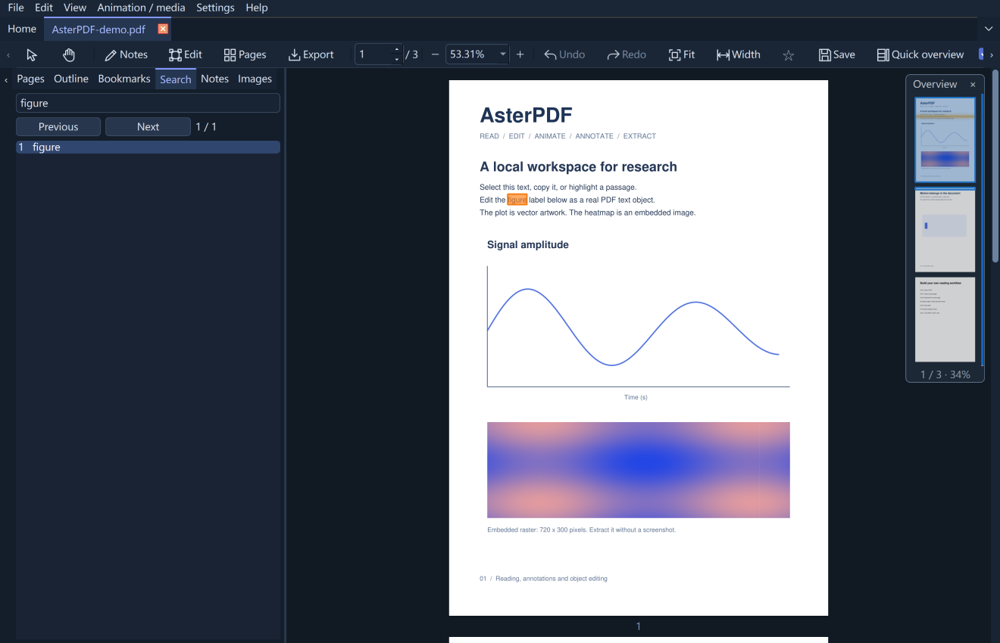
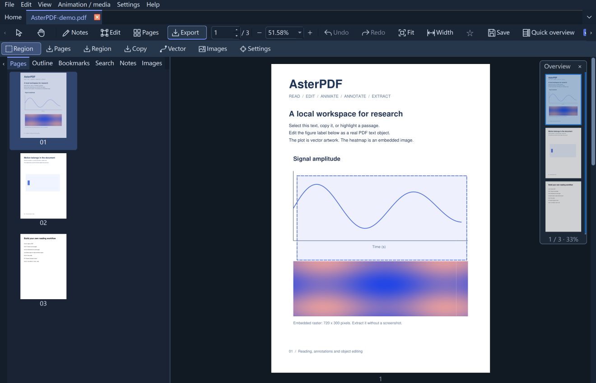
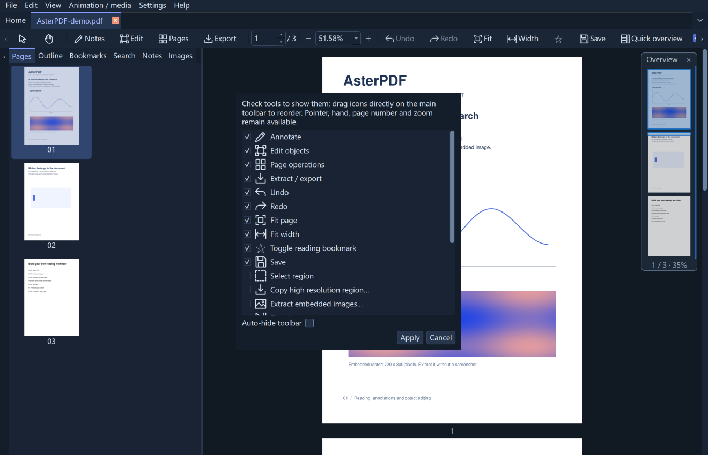

<p align="center"></p>

# AsterPDF

**Read · Edit · Animate · Annotate · Extract**

An offline desktop PDF workspace for research and technical documents.

**[中文](README.zh-CN.md) | English** · [Compatibility](docs/COMPATIBILITY.md) · [Build](docs/BUILDING.md) · [Verification](docs/VALIDATION.md)

<table><tr>
<td><a href="docs/evidence/overview-1.0.png"></a><br>Search & Quick overview</td>
<td><a href="docs/evidence/extract-1.0.png"></a><br>Vector figure extraction</td>
<td><a href="docs/evidence/tools-1.0.png"></a><br>Your tools, your layout</td>
</tr></table>

## What makes it useful

- **Read animated papers.** Play recognized LaTeX `animate` icon/widget sequences and embedded video/audio inside the document, including presentation mode.
- **Markdown and video.** Read mathematical Markdown and export PDF; insert videos, save embedded media and arrange media layers.
- **Extract research figures.** Export high-resolution regions, extract embedded raster images at their original resolution, or save a cropped PDF that retains text and vectors.
- **Edit real PDF content.** Modify identifiable text, images and vector groups. Preserve untouched glyphs; move, resize, delete and paste objects in place across documents. Insert vector PDF figures.
- **Annotate and organize.** Standard PDF comments, character-range markup, reflowing text annotations, page drag/reorder, merge queues, extraction, rotation and adjustable cropping.
- **Navigate comfortably.** Tabs, search, outlines, named bookmarks and a floating Quick overview. Native-DPI rendering, light/dark UI, Chinese/English, customizable tools and local crash recovery.

No account. No cloud dependency. PDF processing stays on your computer.

## 1.2.1 · New since 1.2.0

- **Offline mathematics:** inline/display TeX and fenced `math` blocks in Markdown, preserved as vector paths in exported PDF.
- **Closer to GitHub formatting:** improved nested lists/code, tables, task lists, links and image proportions.
- **No printer connection:** Markdown opens through a direct PDF writer, without querying the system default printer.

[Release notes](docs/RELEASE_NOTES.md) · [Math example](examples/Markdown-math.md) · [Screenshot](docs/evidence/markdown-1.2.1.png)

## Run

**Windows x64:** extract the complete `AsterPDF-1.2.1-windows-amd64.zip`, then run `AsterPDF/AsterPDF.exe`. Keep the accompanying `_internal` folder. No Python installation is required; the executable is unsigned.

**macOS / Linux:** download the native archive from the GitHub Release. The automated build verifies packaging on each target; see the validation and compatibility documents for the features tested on real desktops.

From source (Python 3.12 recommended):

```sh
python -m venv .venv
# Activate .venv: Windows .venv\Scripts\activate; macOS/Linux source .venv/bin/activate
python -m pip install -e ".[dev]"
python -m asterpdf examples/AsterPDF-demo.pdf
```

Dependency installation requires internet access. Optional font lookup, update checks and externally linked Markdown images also use the network.

## Start here

Open a PDF; use the pointer for text/image selection or the hand to pan. The four modules expose annotation, object editing, page organization and extraction tools only when needed. Open **Settings → Preferences** (`Ctrl+,`) for defaults. Right-click the toolbar to customize it.

Double-click an editable text block to edit selected characters. Apply with `Ctrl+Enter`; cancel with `Esc`. Choose **Insert text box** to create independent text. Drag its border to wrap or its circular handle to rotate; precise width and angle are available in the text pane. Files marked `*` contain unsaved changes.

Try the two original sample PDFs in `examples/`. [Usage](docs/USABILITY-1.0.md) · [Shortcuts and help](asterpdf/resources/HELP.en.md)

## Honest boundaries

AsterPDF is a local scientific-document editor, not a full Acrobat replacement. Text editing depends on identifiable content and reliable glyph mappings; complex shaping, arbitrary paragraph reflow and recursive editing inside every Form XObject are not supported. Unsupported edits retain the draft and explain the limitation. Original font resources remain untouched for unchanged text; new input may use an identified local substitute.

Animation support is based on tested icon/widget samples, not general Acrobat JavaScript compatibility. OCG animation, Flash and PDF 3D are unsupported; codecs vary by platform. Page imports do not transfer document-level script/form trees. Mirroring pages with annotations, links or media is refused. See the [compatibility matrix](docs/COMPATIBILITY.md).

No OCR, PDF-to-Word, AI services, certificate signing or mobile client.

## Build and release

The project includes PyInstaller configurations, platform icons, GitHub Actions, third-party licenses and public test fixtures. [Build and packaging instructions](docs/BUILDING.md).

Source and native Windows/macOS/Linux builds are published in [GitHub Releases](https://github.com/eternitylzt/AsterPDF/releases). **Help → Check GitHub updates** compares the installed version with the latest stable Release and opens its download page.

**GitHub About:** Offline scientific PDF editor with LaTeX animation, embedded video, Markdown reading and vector figure extraction.

**Author:** Zhentong Li · eternitylzt@gmail.com

**License:** [AGPL-3.0-only](LICENSE). Dependencies retain their licenses; see [third-party notices](THIRD_PARTY_NOTICES.md). Release binaries must be accompanied by matching source.

### Format and media notes

Markdown uses a lightweight parser to produce searchable PDF, including mathematics, common tables and images; it is not a full browser layout engine and adds no WebEngine. EPS/PS requires a separate Ghostscript installation. Media layer controls reorder same-page media annotations; interactive players remain above ordinary page content. Animation export contains a vector-frame PDF and timing information, not a transcoded MP4. Media support varies by reader, system and codec.
