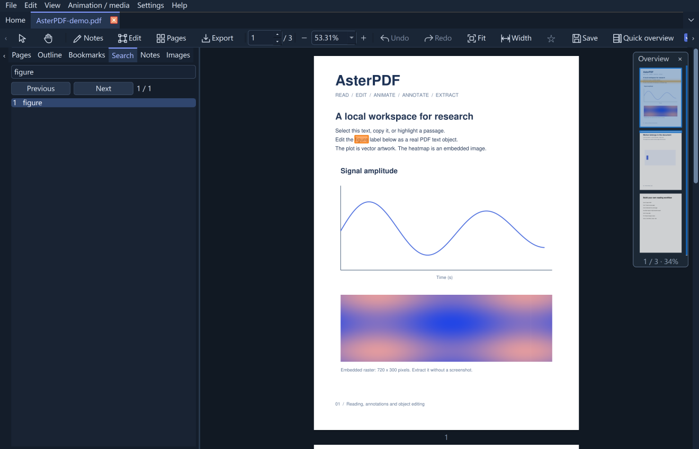
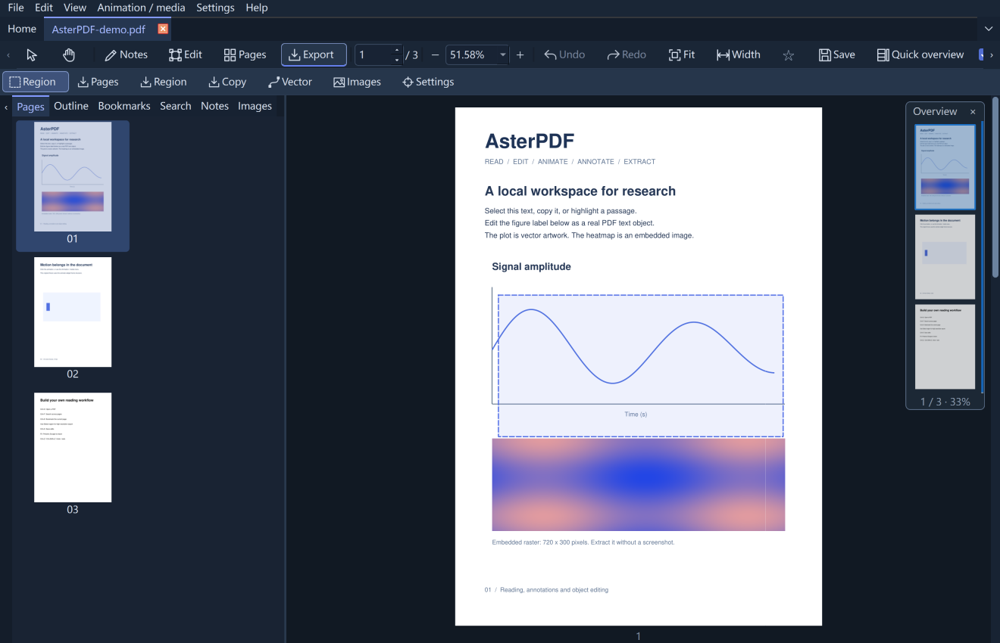
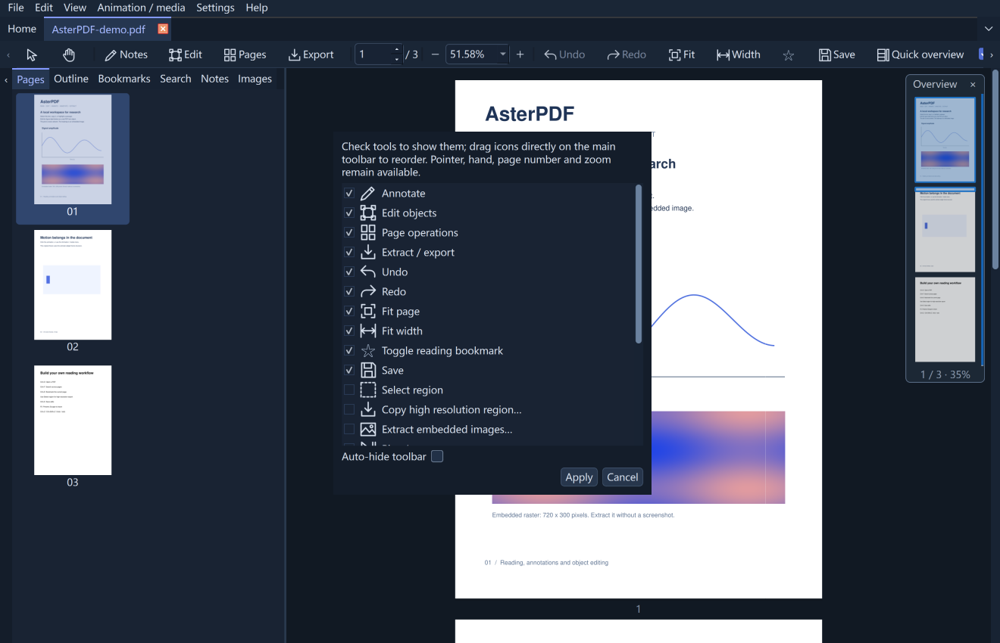

<p align="center"></p>

# AsterPDF

**Read · Edit · Animate · Annotate · Extract**

面向科研与技术文档的离线 PDF 桌面工具。

**中文 | [English](README.md)** · [兼容性](docs/COMPATIBILITY.md) · [构建说明](docs/BUILDING.md) · [验证记录](docs/VALIDATION.md)

<table><tr>
<td><a href="docs/evidence/overview-1.0.png"></a><br>搜索定位 · 速览窗</td>
<td><a href="docs/evidence/extract-1.0.png"></a><br>区域提取 · 保留矢量</td>
<td><a href="docs/evidence/tools-1.0.png"></a><br>自定义工具 · 舒适阅读</td>
</tr></table>

## 特色

- **阅读动态论文**：在文档原位播放已识别的 LaTeX `animate` 动画及内嵌音视频，演示模式同样可用。
- **Markdown 与视频**：阅读含数学公式的 Markdown，支持浏览器 HTML 预览及 PDF/HTML 导出；可在 PDF 中插入视频、提取内嵌媒体并调整媒体层级。
- **提取科研图**：按指定分辨率导出局部高清图片、提取原始内嵌图片，或导出保留文字与矢量的局部 PDF。
- **真实内容编辑**：修改可识别的文字、图片和矢量对象；保留未改动字形，支持移动、缩放、删除和跨文档原位粘贴，也可插入矢量 PDF 图。
- **批注与页面整理**：标准 PDF 批注、逐字高亮、可换行文本批注，页面拖动排序、文件合并队列、页面提取、旋转和可调边框裁剪。
- **原位填写表单**：标准 AcroForm 的文字、复选、单选、下拉、多选列表和常见日期，支持可填区域高亮、Tab 切换、保存及恢复草稿。
- **便捷阅读**：多标签、搜索、目录、命名收藏和悬浮速览窗；适配高 DPI 显示，支持深浅界面、中英切换、自定义工具栏和本地意外退出恢复。

无需账户，不依赖云服务，PDF 处理在本机完成。

### 阅读操作

- **F11**：默认适合宽度的文档全屏，保留已显示的播放控件和速览窗；鼠标移至顶部可呼出缩放、布局及退出控件。再次按 F11 或 Esc 恢复界面；F5 仍为演示模式。
- **Markdown**：先在软件内预览，再询问是否用默认浏览器打开本地 HTML，提供目录、公式、图片和代码复制；勾选“不再提示”可记住“是”或“否”。Settings → 首选项 → Markdown 可设置“每次询问 / 始终打开 / 仅在软件内阅读”。另存为可选择 HTML 或 PDF；PDF 默认 A4 分页，也可保存连续长页。HTML 内嵌已加载的图片与公式，可独立分享，反映打开时的 Markdown 内容；后续 PDF 编辑/批注请保存为 PDF。软件内默认长页阅读并提供标题目录，已有 PDF 编辑时保存当前布局。
- **页间空隙**：双击两页之间的空隙即可紧密排列，再双击淡色分界线恢复；悬停光标提示合并/展开。也可使用“视图 → 隐藏 / 显示页间空隙”。只改变阅读间距，不移除页面本身的白边，不修改 PDF 内容。

## 1.3.2 · 相比 1.3.0

- **Markdown 预览与导出**：先在软件内显示，再询问是否用默认浏览器打开本地 HTML；可记住选择，也可在首选项中修改。支持目录、公式、图片、表格和代码复制，新增另存为 HTML，无需附带浏览器内核。
- **全屏阅读**：默认适合宽度，顶部自动隐藏控件提供整页、缩放、布局与退出，退出后恢复原缩放。
- **首页最近文件**：优先显示五条完整记录，小窗口可滚动浏览。
- **macOS 视频交互**：调整视频点击处理和播放状态同步，针对单击暂停需要两次点击的问题修复；实际用户 Mac 环境仍需复测。

[发布说明](docs/RELEASE_NOTES.md) · [公式示例](examples/Markdown-math.md) · [效果截图](docs/evidence/markdown-1.2.1.png)

## 运行

[Linux 安装：deb / rpm / 免安装包](docs/LINUX.md)

**Windows x64**：完整解压 `AsterPDF-1.3.2-windows-amd64.zip`，运行 `AsterPDF/AsterPDF.exe`。请保留同目录的 `_internal` 文件夹，无需安装 Python。当前程序未签名。

**macOS / Linux**：请从 GitHub Release 下载相应平台的原生构建。自动化任务验证各平台打包是否成功；真实桌面功能的实测范围见验证记录与兼容性说明。

源码运行（建议 Python 3.12）：

```powershell
python -m venv .venv
.\.venv\Scripts\Activate.ps1
python -m pip install -e ".[dev]"
python -m asterpdf examples/AsterPDF-demo.pdf
```

安装依赖需要联网；可选的在线字体查找、检查更新和 Markdown 关联的网络图片也会联网。

## 快速上手

打开 PDF 后，用指针选择文字或图片，用手形平移。四个功能区按需展开批注、编辑、页面和提取工具。**设置 → 首选项**（`Ctrl+,`）集中管理默认参数，右键工具栏可自定义工具。

双击可编辑文字块进入编辑，选中文字后修改样式；`Ctrl+Enter` 应用，`Esc` 取消。“插入文本框”可创建独立文字，拖动边框调整换行宽度，拖动圆形控制点旋转；文字设置栏也提供精确宽度与角度。文件名中的 `*` 表示尚未保存。

`examples/` 包含两个原创示例 PDF。[详细操作](docs/USABILITY-1.0.md) · [快捷键与帮助](asterpdf/resources/HELP.zh-CN.md)

## 能力边界

AsterPDF 不承诺完整替代 Acrobat。文字编辑依赖可识别结构和可靠的字形映射；不支持复杂文字塑形、任意段落重排，也不能进入所有嵌套 Form 编辑内部标签。无法可靠修改时会说明原因并保留草稿。未改动文字保留原字体资源；新增文字可能使用明确提示的本地替代字体。

动画支持基于已测试的 icon/widget 样例，不等同于通用 Acrobat JavaScript 兼容。OCG 动画、Flash、PDF 3D 不支持；音视频编码支持随平台变化。导入页面不转移文档级脚本或表单树；含批注、链接或媒体的页面暂不支持整体镜像。详见[兼容性说明](docs/COMPATIBILITY.md)。

不含 OCR、PDF 转 Word、AI 服务、证收藏名和移动端。

## 构建与发布

项目包含 PyInstaller 打包配置、平台图标、GitHub Actions、第三方许可证与公开测试样例。[构建及发布步骤](docs/BUILDING.md)。

源码与 Windows/macOS/Linux 原生构建发布在 [GitHub Releases](https://github.com/eternitylzt/AsterPDF/releases)。**帮助 → 检查 GitHub 更新**会比较当前版本与最新正式 Release，并打开下载页面。

**GitHub 简介：** 面向科研的离线 PDF 编辑器，支持 LaTeX 动画、视频插入、Markdown 阅读与保留矢量的科研图提取。

**作者：** Zhentong Li · eternitylzt@gmail.com

**许可证：** [AGPL-3.0-only](LICENSE)。各依赖保留自身许可证，见[第三方声明](THIRD_PARTY_NOTICES.md)。发布二进制时应同时提供对应源码。

### 格式与媒体说明

Markdown 使用轻量解析器生成可搜索 PDF，支持数学公式、常见表格及图片，不等同于完整浏览器排版；无需引入 WebEngine。EPS/PS 需要另外安装 Ghostscript。视频层级调整的是同页媒体批注的叠放顺序，播放层位于正文内容之上；不会把视频压平为图片。动画导出为矢量帧 PDF 与帧率信息，非转码 MP4。各阅读器、系统和编码的媒体支持有差异。
